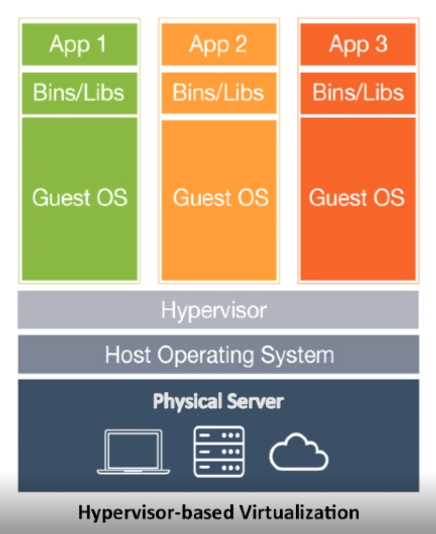
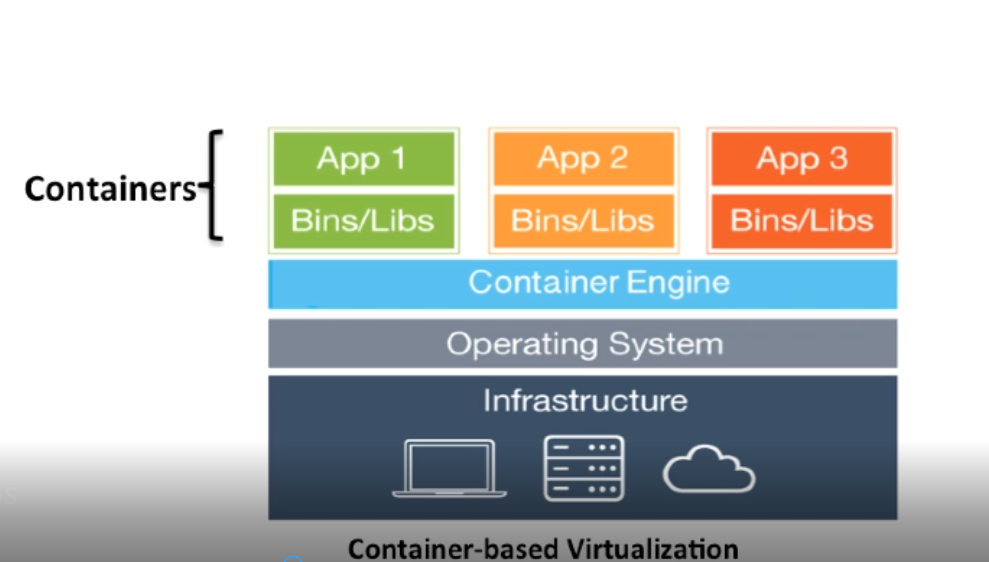
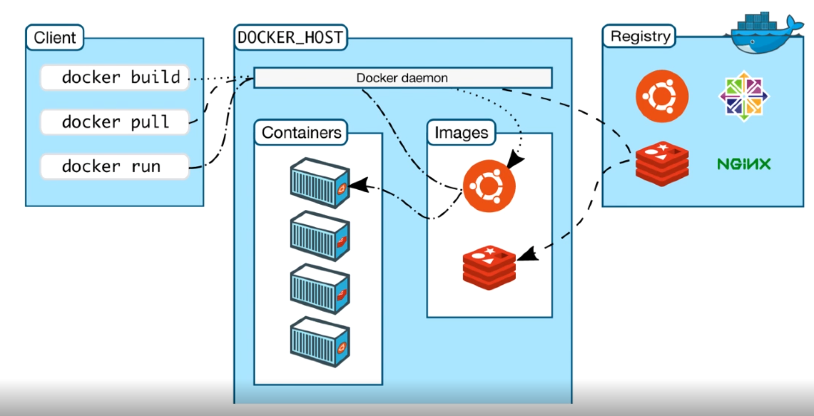
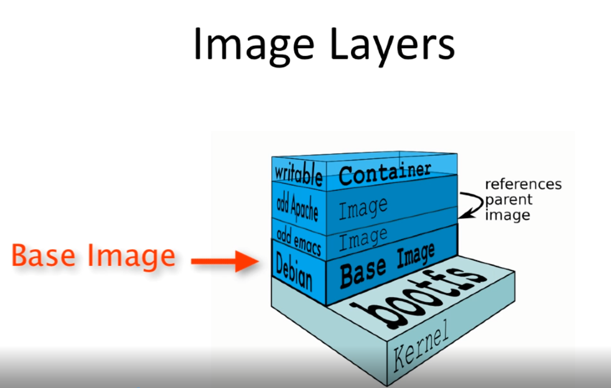
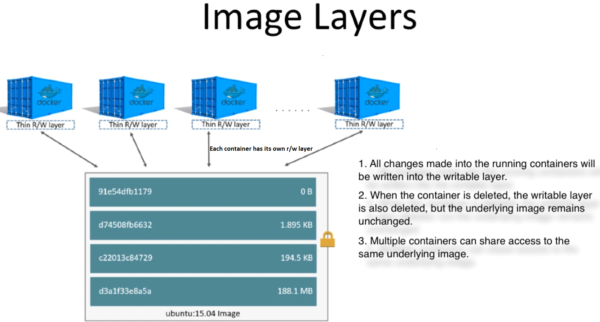
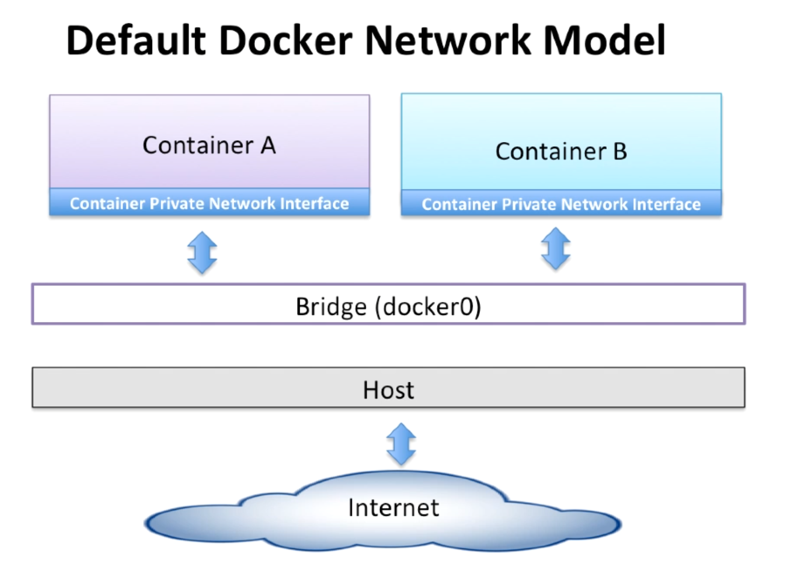

Notes:

Hypervisor technology (VMWare, VBox) - need guest operating system for each VM and resources either wasted or duplicated. No easy migration of VM




Docker Technology - container based virtualization technology



Docker Info

Docker daemon is also referred as docker engine and docker server



Docker Public Registry is docker-hub (inside registry, images are stored in repositories.  
So Docker repository is collection of different docker images with the same name [example: thanujtk/jenkins:tags],  
that have different tags, each tag usually represent different version of the image - using image layers - **docker history**)

**Note** - __docker container run__ or __docker run__ is short hand for __docker container create__, so always new container is created, instead use __docker container start__  or __docker start__

```
docker history busybox (provides different image layers)
docker run --rm -it busybox sh (to remove the container when execution is done)
docker run -it busybox sh  (below is the container id created by this run)
docker start -i fef75487bdaf
```




**Two ways to build docker images**
1. Commit changes made to docker container
2. Write a dockerfile

```
> docker run -it debian:jessie   (install base image and to it install git)
> root@8dffaa23f6f6:/# apt-get update && apt-get install -y git  (inside the container)
> docker commit 8dffaa23f6f6  thanujtk/debian:1.0 (docker ps to get image id of above container)
> docker history thanujtk/debian:1.0  (to know the new layer that has been added)
```
In case of dockerfile each instruction create a new image layer (instruction specifies what to do when building image)

The '.' for docker build is **"docker build context path"**
1. docker build command takes the path to build context as argument
2. when build starts docker build client would pack all the files in build context into a tarball then transfer file to the daemon
3. By default, docker would search for default Dockerfile in the build context path

```
 > docker login  ( https://registry-1.docker.io/v2/ )
 > docker build -t thanujtk/debian:1.1 -f 01-Dockerfile .
 > docker history thanujtk/debian:1.1 (to know the images layer for each RUN command)
 
 Reduce the image layers created
 > docker build -t thanujtk/debian:1.2 -f 02-Dockerfile .
 > docker history thanujtk/debian:1.2 (less image layers and also less memory)
 
```
##### <u>CMD Instruction</u>
1. CMD instruction specifies what command needs to be run when the container starts up.
2. If we don't specify CMD instruction in the Dockerfile, docker will use the default command defined in the base image.
3. The CMD instruction doesn't run when building image, it only runs when the container starts up.
4. You can specify the command in either exec form which is preferred or in shell form
5. We can override the CMD instruction at container startup

```
> docker build -t thanujtk/debian:1.3 -f 03-Dockerfile .
> docker run --rm thanujtk/debian:1.3  (This will print hello world text)
> docker run --rm thanujtk/debian:1.3 ls -la  (overriding default cmd)
```

##### <u>Docker Cache</u>
1. Each time docker build (image creation) executes a instruction, it builds new image layer
2. Next time, if the same instruction is run (no change), docker will simply reuse the existing layer

Sometime cache may create problems due to aggressive caching to avoid cache altogether specify **--no-cache** option
```
> docker build -t thanujtk/debian:1.3 -f 03-Dockerfile . --no-cache=true
```

##### <u>COPY Instruction</u>
1. COPY instruction copies new files or directories from build context and adds them to the container file system.
```
> docker build -t thanujtk/debian:1.4 -f 04-Dockerfile . 
> docker run --rm thanujtk/debian:1.4  ls -la ./tmp/
> docker run --rm -it thanujtk/debian:1.4  (login to container with default CMD and check /tmp)
```
##### <u>ADD Instruction</u>
1.  Similar to COPY, in addition allows to download file from internet and copy to container.
2. ADD instruction also has ability to automatically unpack compressed files.


##### <u>Tagging existing image with new name</u>

```
> docker tag b59d8cfe1024 thanujtk/tutorial_debian:1.1  (changing thanujtk/debian:1.4 to new tag, note image id will be same)
> docker login --usename=thanujtk
> docker push thanujtk/tutorial_debian:1.1
```

##### <u>Running docker app as admin user - 05-Dockerfile</u>
```
> docker build -t thanujtk/debian:1.5 -f 05-Dockerfile .
> docker run -it  --rm thanujtk/debian:1.5 ( will be placed at > admin@57ca20d81d77:/images$ )
> docker exec -it <container-id> bash ( you can login to running container from new command prompt to know that default user is admin)
```

##### <u> Docker container links</u>
1. Main benefit is to link different containers to communicate each other
2. linking container will have entry in /etc/hosts (docker run -d -p 5000:5000 --link redis tomcat/tomcat)
3. Docker creates a secure tunnel between the containers that doesn't need to expose any ports externally on the container
4. Manual linking of containers becomes complicated when more container needs to communicate, so use docker-compose (from version 3 no need to create link in docker-compose as network will take care of it)

One of the many in-built docker's features is networking. Docker networking feature can be accessed by using a --link flag which allows to connect  
any number of docker containers without the need to expose container's internal ports to the outside world.

There is nothing new about the above command (1>) except to note that we are not exposing any network ports even though our intention is to  
access services ( ssh, database etc.) via their relevant port numbers.

```
1> docker run --rm -it --name sandbox1 -h sanbox1 linuxconfig/sandbox /bin/bash    (-h hostname of container)
2> docker run --rm -it --name sandbox2 -h sandbox2 --link sandbox1:sandbox1 linuxconfig/sandbox /bin/bash (--link containerId:alias)
```
Furthermore, --link flag will enable the parent container to access any services running on sandbox1 container via its corresponding ports numbers  
without the child container's  need to expose any ports to outside world.

##### <u> Docker Compose </u>
Compose is a tool for defining and running multi-container Docker applications.
```
> docker-compose -f 06-docker-compose.yml up   (check container would be created and exited)
> docker-compose -f 06-docker-compose.yml up -d (in background, by using docker-compose you could use same stopped container to restart/start)
> docker-compose -f 06-docker-compose.yml stop
> docker-compose -f 06-docker-compose.yml start
> docker-compose -f 06-docker-compose.yml restart
> docker-compose -f 06-docker-compose.yml rm
> docker-compose down  (will remove containers and network bridge too)
> docker-compose ps
> docker-compose logs
> docker-compose logs -f
> docker-compose logs <container-name>  - only logs from that container
```

##### <u> Docker Network types </u>

1. Closed Network/None Network - no access to outside and container is isolated from other containers
2. Bridged Network
3. Host Network
4. Overlay Network

```
> docker network ls   (by default bridge, host and none will be present)
> docker network inspect 70b1813cec07  (checking bridge network listed above and will be able to view subnet details)
```


<u>Closed/None Network</u>

```
> docker run --rm -d --net none linuxconfig/sandbox sleep 1000   (Closed/None example, can't ping to outside and also only one local loop network from ifconfig)
```
<u>Bridged Network</u>
* This is the default network
* In bridge network, container has two interface - loopback (lo) and private (eth0)
* All containers in same bridge network can communicate each other
* Containers from different bridge network can't communicate each other by default unless bridges are connected

```
> docker network ls
> docker network inspect bridge
> docker run --rm -d --name container_1 linuxconfig/sandbox sleep 1000  (no --net parameter, by default bridge is assigned, has access to outside and any linked container, has two network loopback and eth0)
> docker run --rm -d --name container_2 linuxconfig/sandbox sleep 1000 (check the IP's through private IP can ping other though --link is not provided)
```
To create a new bridge network separate from default

```
> docker network ls
> docker network create --driver bridge tk_bridge_nw
> docker network ls
> docker network inspect tk_bridge_nw   (check subnet range is different)
> docker run --rm -d --name container_3 --net tk_bridge_nw linuxconfig/sandbox sleep 1000  (running new container under tk_bridge_nw, but this can't connect with other bridge by default, see below how to solve it)
```
How to connect between different bridge networks
```
> docker network connect bridge container_3  (here bridge is the default in which container_1 and container_2 is running, now you will see 3 networks - eth0, eth1 and lo) 
> docker network disconnect bridge container_3  (to disconnect, now only 2 networks shown - eth0 and lo )
```

<u>Host Network</u>
The least protected network model, it adds a container on the host's network stack (full access to host interface). These sort of containers are called **Open Containers**
One benefit is performance (use there is valid reason)

```
> docker run --rm -d --name container_4 --net host linuxconfig/sandbox sleep 1000  (lists all host network interfaces and good performance as no SDN in between)
```

<u>Overlay Network</u>

Multi-host networking (supported out-of-the-box) - mostly used in production where deployment are on different machines

Need to satisfy pre-conditions
1. Running docker engine in swarm-mode
2. A key-value store such as consul

<u>Defining network using docker-compose</u>

```
> docker-compose 0f 07-docker-compose.yml up -d
> docker network ls
> docker network rm docker-tutorial_tk_net
```

<u> Defining Custom Network Driver</u>
Used in complex scenarios to isolation access between different layers and where options can be passed to driver

--------------------------------------
08-Dockefile

```
> docker build -t dockertk/git -f 08-Dockerfile .
> mkdir in D://DELETE/source
> docker run -v D://DELETE/source:/source dockertk/git git clone https://github.com/thanujkumar/docker-hub.git -b master /source
> docker run -v $(pwd):/source -it node:8 bash    (Running nodejs in current folder mapped to source)
```
* 