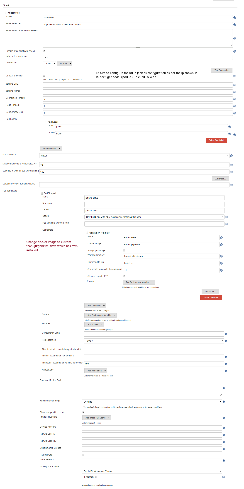

1. Build the Dockerfile from the location where Dockerfile exists

    ```
    > docker build -t thanujtk/jenkins-master-kube:v1.0 .
    > docker images (should show thanujtk/jenkins-master-kube:v1.0)
    > docker push thanujtk/jenkins-master-kube:v1.0
   
    To check image is valid, you can run as docker container
    > docker run --rm -d -p 8080:8080 thanujtk/jenkins-master-kube:v1.0
    > docker delete <docker id>
    ```
   
2. Next is create jenkins-deployment.yaml for running the image as pod in kubernetes
    ```
    Create a namespace ci-cd
    > kubectl create ns ci-cd
   
    To create deployment in ci-cd, once deployment done a pod is created
    > kubectl apply -f jenkins-deployment.yaml -n ci-cd
    > kubectl describe pod jenkins -n ci-cd
   
    In addition to pod creation via deployment, we need to create the Jenkins service
    > kubectl apply -f jenkins-service.yaml -n ci-cd
    > kubectl apply -f jenkins-slave-service.yaml -n ci-cd
    ```
   
3. Login to jenkins and configure Jenkins slave
    ```
     > kubectl get svc -n ci-cd (to get port)
     
     To identify kubernetes cluster info for identifying the  kubernetes master address
     > kubectl cluster-info (to know the internal url of kubernetes master)
     > kubectl get pods -n ci-cd -o wide (to know the ip of the jenkins master)
     > (Another way to find IP) kubectl describe pod jenkins-68bbbf7665-lnhdz -n ci-cd (to find IP address of jenkins master)
   
     Now fill the kubernetes configuration information in jenkins server (master)
      Manage Jenkins -> Configure Jenkins
    ```
   
   
