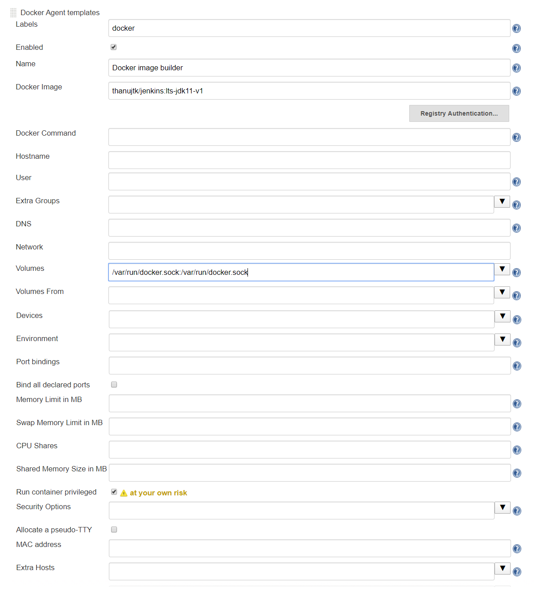

Installing docker with-in jenkins container and running as docker daemon

Look at Dockerfile how https://get.docker.com is used to install docker 

  ``` 
 > docker build -t thanujtk/jenkins:lts-jdk11-v1 - < Dockerfile

  OR from location where Dockerfile exits

 > docker build -t thanujtk/jenkins:lts-jdk11-v1

  This image should be run with --privileged 
  Using docker run --privileged ......
  https://blog.trendmicro.com/trendlabs-security-intelligence/why-running-a-privileged-container-in-docker-is-a-bad-idea/

 > docker run --rm --privileged --name docker-daemon thanujtk/jenkins:lts-jdk11-v1
  login to container as 'jenkins' user, docker-daemon is container name 
 > docker exec -it --user jenkins docker-daemon /bin/bash

  Now you can verify that docker is running inside the container (docker ps)
  Just to verify that i can build image in container, i will copy the meta-build/Dockerfile to this container and run it
  Open CMD window and run below command to copy to  docker-daemon container
  
  >  docker cp Dockerfile docker-daemon:/

  Next go into the docker-daemon container and from the /  execute the build in the container to check docker daemon is working fine
  
  jenkins@e1d9beda693e:/$ docker build -t thanujtk/jenkins:lts-jdk11-v2 - < Dockerfile
 ``` 

 Next is to create a Jenkinsfile (buildDeploy.Jenkinsfile) which will build a docker image from ./images/Dockerfile and move it to dockerhub
 
 We run thanujtk/jenkins:lts-jdk11 as jenkins server
 
 Then we configure jenkins server to point to  daemon to build docker images as below (which will be pulled by jenkins as a docker daemon agent and run in the container.
 
 Next create a job "DotnetImage-DockerAgent" as "pipeline" build
 Configured username as "thanujkumar" and personal token - e70e26fa5712744f0652deaecc47802db3019b71 as defined for "Laptop-Docker"
 
 Note: above token didn't work from agent point so made the repository public.
 
 Below is the configuration done to Jenkins http://localhost:2112/configureClouds/
 
 Ensure to create a username-password credentials and set the id to thanujtk-id which is used in buildDeploy.Jenkinsfile
 
 - Name of Job: DotnetImage-DockerAgent
 - Git Location: https://github.com/thanujkumar/docker-hub.git
 - Jenkinsfile Location: pluralsight_jenkins/jenkins-docker/meta-build/buildDeploy.Jenkinsfile

 Jenkins URL examample: http://localhost:9993/configureClouds/
  Next is to install docker plugin, in Jenkins as Admin go to plugins
   > Jenkins > Manage Jenkins > Manage Plugins

in jenkins container to know internal host name it will be > ping host.docker.internal (this will resolve to ip)
  > Jenkins > Manage Nodes and Clouds > Configure Clouds > Add New Cloud (select Docker)
  Test and then select "Enabled" and "Expose DOCKER_HOST", next is to add "Docker Agent templates"

 


 
 https://k6.io/blog/bootstrap-your-ci-with-jenkins-and-github  (on how to have credentials for login to GitHub)
 
 Developer personal token - https://github.com/settings/tokens
 
 Different ways of connection to docker agent/container by jenkins master
 
 
 
 In JNLP and SSH, slaves communicate directly with master
 
 In Attach Container communication is enabled by Host
 
 