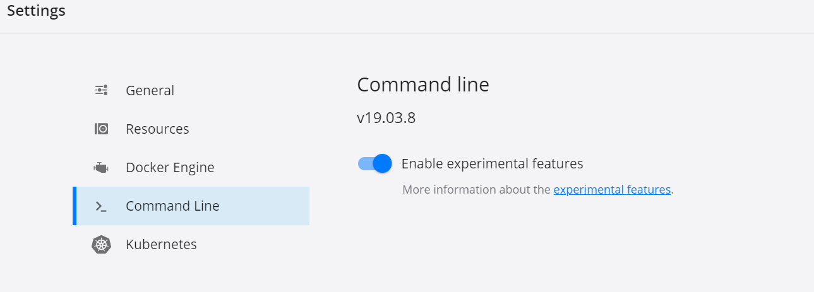

Building multi-architecture container.

Whenever docker pull is issued manifest of the image is looked to get the architecture support and one that is supported is pulled.

``` 
 docker image inspect --format '{{.Os}}/{{.Architecture}}' thanujtk/jenkins:lts-jdk11
 

> docker pull microsoft/dotnet-framework
  Using default tag: latest
  latest: Pulling from microsoft/dotnet-framework
  no matching manifest for linux/amd64 in the manifest list entries

  Next run for core, which is downloaded 

 > docker run mcr.microsoft.com/dotnet/core/runtime
 > docker image inspect --format '{{.Os}}/{{.Architecture}} mcr.microsoft.com/dotnet/core/runtime
  'linux/amd64

  If we use windows docker container instead of linux docker container, above images can be pulled

> docker manifest inspect mcr.microsoft.com/dotnet/core/runtime
  docker manifest inspect is only supported on a Docker cli with experimental cli features enabled 

 After enabling experimental features
> docker manifest inspect mcr.microsoft.com/dotnet/core/runtime

``` 
Enabling experimental features (also required for buildx which targets multi-architecture)




We are going to create two products of microsoft images having jenkins + dotnet core target to two architecture (AMD 64 and ARM) using buildx experimental feature

Verify buildx is enabled
``` 
 > docker buildx
 To get available targets
 > docker buildx ls
    NAME/NODE DRIVER/ENDPOINT STATUS  PLATFORMS
    default * docker
      default default         running linux/amd64, linux/arm64, linux/ppc64le, linux/s390x, linux/386, linux/arm/v7, linux/arm/v6
      Build image (by default target to docker container architecture - linux/amd64)

 > docker build -t thanujtk/dncgit - < dotnet.Dockerfile

  Let us run the above image
 > docker run --name dncgit thanujtk/dncgit tail -f /dev/null
 
  Next we open window to above container which is pointed to null (a way to hold the container which doesn't have entry point)

 > docker exec -it dncgit /bin/bash

 Now you can > dotnet --version and > git command

 Next let us build for arm7 with below command

 > docker buildx build -t thanujtk/dncgit:arm7 --platform linux/arm/v7 - < dotnet.Dockerfile
 > docker buildx build -t thanujtk/dncgit:amd64 --platform linux/amd64 - < dotnet.Dockerfile

 Then inspec the image with below command

 > docker image inspect thanujtk/dncgit:amd64

 We created individual images for different architecture above
 Next is to create a manifiest that holds both images (arm7 and amd64)

 Let us create a space named tkspace
 > docker buildx create --name tkspace
 Next use that space
 > docker buildx use tkspace

  From that space build both and push to docker hub

 > docker buildx build -t thanujtk/simplednc --platform=linux/amd64,linux/arm/v7 - < dotnet.Dockerfile --push

 Next you can inspect the manifest and when docker pull is done for this image based on the manifest (target docker arch) image is pulled

 > docker manifest inspect thanujtk/simplednc

 To enable experimental feature for docker daemon (thanujtk/jenkins:lts-jdk11-v1) have below environment variable in Dockerfile
 ENV DOCKER_CLI_EXPERIMENTAL=enabled
 
 Check ex-jenkinsdocker-Dockerfile to know to build experimental docker agent, let us build this image

 > docker build -t thanujtk/ex-jenkinsdocker - < ex-jenkinsdocker-Dockerfile

 Next let us run this image
 > docker run --name extest --privileged thanujtk/ex-jenkinsdocker 

 Get into the docker agent and should be able to execute experimental commands as above
 > docker exec -it extest /bin/bash
 > docker cp dotnet-Dockerfile extest:/
 Enable docker login to able to push
 > docker login -u thanujtk -p <password>
 > docker buildx build -t thanuj/simplednc --platform..... command as above
``` 
