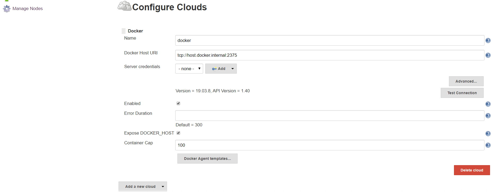

This has following examples:

- Using Installed Docker (exposed through localhost:2375) to be used as docker agent that will pull images to execute jobs in jenkins slaves
- Next is creating an image that has docker installed in it and using it to pull images and execute jenins jobs
- Next is looking at build multi-arch images using buildx (experimental feature)

Major difference between Virtual Machine vs Docker
 - Docker uses shared kernel vs each instance of VM will have it own kernel (not shared)
 
 Types of Kernel
 - Linux - mono kernel (one kernel for all processes)
 - Minix - micro kernel (Kernel per user space)
 - Windows - a hybrid of both approaches
 
 Jenkins Queue Models
  -  Master-Slave
  -  Dedicated Machines
  -  Dedicated VM's

  ### Creating my own lts-jdk11 jenkins with maven installed (Dockerfile has details)
 ```
  > docker build -t thanujtk/jenkins:lts-jdk11 .
  > docker push thanujtk/jenkins:lts-jdk11

  To login to container as root
  > sudo docker exec -u root -it [container-id] bash
 ```   
   
  #### Commands (#> commands can be used to create dockerfile)
  
  ``` 
   > docker search jenkins
   #> docker pull thanujtk/jenkins:lts-jdk11
   > docker run -p 8080:8080 thanujtk/jenkins:lts-jdk11
   > docker run --rm -p 2112:8080 thanujtk/jenkins:lts-jdk11  (binding to local port 2112 and when stopped remove container)

   Let us create a jenkins-master with below command (jenkins_home at /var/jenkins_home and 50000 is the slave port)
   > docker run -p 2112:8080 -p 50000:50000 --name jenkins-master thanujtk/jenkins:lts-jdk11

   Enable file sharing in docker and run below command (ensure folder C://DOCKER/Volumes/jenkins-master is created)
   Ensure to remove previous container with same name 
  > docker container ls -a and use > docker container rm <id>
  > docker run -p 2112:8080 -p 50000:50000 -v C://DOCKER/Volumes/jenkins-master:/var/jenkins_home --name jenkins-master thanujtk/jenkins:lts-jdk11

  To force the plugin upgrades you could run as below

  > docker run -p 2112:8080 -p 50000:50000 -e PLUGINS_FORCE_UPGRADE=true -v C://DOCKER/Volumes/jenkins-master:/var/jenkins_home --name jenkins-master thanujtk/jenkins:lts-jdk11


  > docker start jenkins-master (to restart the stopped container with --name, if --name is not given random name is created)
  With above approach even if remove container and re-run with above command nothing changes as volume mapped still exists on local machine
 
  Next is running jenkins Agent
  - First enable in docker settings for docker remote api "Expose daemon on tcp://localhost:2375 without TLS"
  - If you have issue with port 2375 (as HyperV would have used or windows would have reserved) - https://github.com/docker/for-win/issues/3546
  - [CMD] netsh int ipv4 add excludedportrange protocol=tcp startport=2375 numberofports=1
 
   How?
    - Docker remote API is enabled
    - Configure Docker in our jenkins-master
    - Create single containerized build agent
    - Slave it to our jenkins-master
    - Execute labeled builds
   
    To check Docker remote API is enabled
    - http://localhost:2375/containers/json

    Next is to install docker plugin, in Jenkins as Admin go to plugins
     > Jenkins > Manage Jenkins > Manage Plugins > 
 ``` 
   
 ``` 
   in jenkins container to know internal host name it will be > ping host.docker.internal (this will resolve to ip)
   > Jenkins > Manage Nodes and Clouds > Configure Clouds > Add New Cloud (select Docker)
   Test and then select "Enabled" and "Expose DOCKER_HOST", next is to add "Docker Agent templates"
 ``` 

 ``` 
  Configuring docker agent 
 ``` 

 ``` 
  Now create just a helloWorld free-style job and configure to run on "slave" (General > Restrict where this project is run) and build
  View jenkins logs at > http://localhost:2112/log/all

  To view images that have vulnerabilities - https://snyk.io/blog/top-ten-most-popular-docker-images-each-contain-at-least-30-vulnerabilities/
  Best practices - https://snyk.io/blog/10-docker-image-security-best-practices/

  When adding ssh-key to agent in container to configure ssh-key with github if issue exists restart agent
  eval `ssh-agent -s`
  ssh-add ~/.ssh/id_rsa
   ``` 
