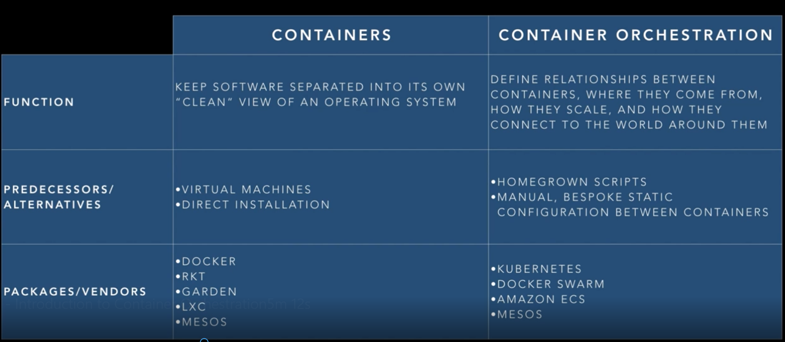

Debian OS - debian 

CentOS - centos 

AlpineOS - alpine

To copy existing tag as rename as latest
 
 **__docker tag a841d3cc08b6 thanujtk/alpine:latest__**


Linking docker images
--------------------------
download tomcat and memcached

__docker pull tomcat__ 

__docker pull memcached__

Next is to run each of them (docker run -it --rm -p 8888:8080 tomcat) (docker run --rm -d -p 11211:11211 memcached)

Stop all container and remove them, running with linking where tomcat
needs memcached server for it to access cache by its application

__docker run --rm -d --name memcached -p 11211:11211 memcached__ 

Next we need to connect tomcat to memcached which is named as memcached,
below running tomcat linked to memcached

__docker run --rm -d --name tomcat -p 8888:8080 --link memcached 
tomcat__
 
 Now get to tomcat bash and should be able to ping memcached
 
 __docker exec -it <container id> bash__
 
 __ping memcached__
 
 also check __>more /etc/hosts__ file to understan how container id is
 mapped for communication 
 
``` 
root@3c89a8460c8e:/usr/local/tomcat# more /etc/hosts
127.0.0.1       localhost
::1     localhost ip6-localhost ip6-loopback
fe00::0 ip6-localnet
ff00::0 ip6-mcastprefix
ff02::1 ip6-allnodes
ff02::2 ip6-allrouters
172.17.0.2      memcached 801220afa4b3
172.17.0.3      3c89a8460c8e
```
for memcached we don't need to expose ports if link is created between
tomcat and memcached (if memcached is going to be accessed by tomcat) as
--link creates a secure tunnel between containers that doesn't need to
expose any ports externally on the container.

Manual linking of containers and configuring services becomes
impractical when number of containers grows, so the approach is to use
__docker-compose__, define docker-compose.yml.

docker-compose had issue on CentOS7 - (__pip install requests urllib3
pyOpenSSL --force --upgrade__) , after above execution it worked,
example of using pip (pip install --upgrade pip)

few commands docker-compose ps, docker-compose logs, docker-compose rm,
docker-compose build

WHAT and WHY - CONTAINERS, ORCHESTRATION
-----------------------------------


